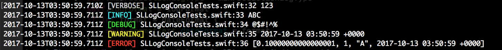
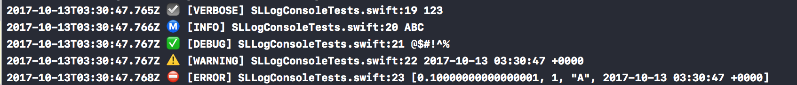

# SLLog

<p align="center">
<a href="http://swift.org">

</a>
<a href="https://raw.githubusercontent.com/shial4/SLLog/master/LICENSE">

</a>
<a href="https://travis-ci.org/shial4 /SLLog">

</a>
<a href="https://codebeat.co/projects/github-com-sllog-sllog-master">

</a>
</p>

SLLog is a simple yet elegant swift logger. Allows you to log content to file, console or your custom target.

```swift
1990-02-19T22:45:36.250Z [VERBOSE] MyFile.swift:19 - 123
1991-03-20T20:33:44.777Z [INFO] MyFile.swift:20 - ABC
1992-04-21T09:53:51.021Z [DEBUG] MyFile.swift:21 - @$#!^%
1993-05-22T11:05:02.000Z [WARNING] MyFile.swift:22 - 2017-10-04 22:45:36 +0000
1994-06-23T15:13:00.146Z [ERROR] MyFile.swift:23 - [0.10000000000000001, 1, "A", 2017-10-04 09:55:36 +0000]
```

<p align="center">


</p>

## 🔧 Installation

Add the following dependency to your `Package.swift` file:
```swift
.package(url: "https://github.com/SLLog/SLLog", from: "1.0.0"),
```

## 💊 How To Start

### 1 Import

On top of your file import:
```swift
import SLLog
```

### 2 Usage

Log any information you need with `Log` class
```swift
Log.d("ABC")
Log.w("#%^$&@")
Log.e("1233")
```
Any object.
```swift
SLLog.addHandler(SLLogConsole())
Log.v(123)
Log.i("ABC")
Log.d("@$#!^%")
Log.w(Date())
Log.e([0.1,1,"A",Date()])
```

### 3 Initialize

Setup SLLoger
```swift
SLLog.addHandler(try! SLLogFile("path/to/directory"))
```
Or console handler
```swift
SLLog.addHandler(SLLogConsole())
```
or both
```swift
SLLog.addHandler(SLLogConsole(), try! SLLogFile(path))
```
You can create your custom log handler. Simply correspond to `LogHandler` protocol.

```swift
public class MyHandler: LogHandler {
    open func handle(log: String, level: SLLog.LogType, file: String, line: UInt, message: Any) {
        //Do your stuff with log.
    }
}
```
then add it to SLLog
```swift
SLLog.addHandler(MyHandler())
```

### 4 Providers

SLLog can have custom providers. To add your own provider 
```swift
struct MySLLogProvider: LogProvider {}
SLLog.addProvider(MySLLogProvider())
```
can you can use `LogProvider` build in method send. To send your log via SLLog.

## 5 SLLogConsole
Default console log:
```swift
isDebug: Bool = true,
isTerminal: Bool = {
        #if Xcode
        return false
        #else
        return true
        #endif
    }(),
minProductionLogType: UInt = 3
logFormat: String = ":d :t :f::l :m",
dateFormat: String? = nil,
logColors: [SLLog.LogType:LogColor]? = nil
```
Override argument passing it in initializer to variate ConsoleLog
`SLLogConsole(isDebug: true, isTerminal: false)`
or
`SLLogConsole(isTerminal: false)`
and so on.
Use isTerminal property to choose between terminal or console settings.

By default, logs are set for a terminal.
log format `":d :t :f::l :m"` where

    `:d` is replaced in string to display date
    `:t` is replaced by log type
    `:f` is replaced by file name
    `:l` is replaced by line number
    `:m` is replaced by message object

Default date format used by logger is as follow `"yyyy-MM-dd'T'HH:mm:ss.SSS'Z'"`

To get rid of default log colors pass empty dictionary in `logColors` or dictionary with your own definitions.
For more information about terminal color take a look: `https://misc.flogisoft.com/bash/tip_colors_and_formatting`

### LogColor

LogColor is defined as follow `init(_ terminal: String, _ console: String)`
For XCode console emoticons are used as collor.

```swift
SLLog.LogType.verbose:LogColor(TerminalColor.lightGray, "☑️"),
SLLog.LogType.info:LogColor(TerminalColor.lightCyan, "Ⓜ️"),
SLLog.LogType.debug:LogColor(TerminalColor.lightGreen, "✅"),
SLLog.LogType.warning:LogColor(TerminalColor.lightYellow, "⚠️"),
SLLog.LogType.error:LogColor(TerminalColor.lightRed, "⛔️"),
```
Use `TerminalColor`  to fast access predefined colors values

## 5 SLLogFile
SLLogFile save logs to files which are created on daily basis.
File names are as follows: `"yyyy-MM-dd"`. Created under `:yuorPath/sllogs` with extension `.log`
Default `maxFilesCount` is set to `3` wich means logger stores 3 files at a time.
1 file = 1 day logs


## ⭐ Contributing

Be welcome to contribute to this project! :)

## ❓ Questions

You can create an issue on GitHub.

## 📝 License

This project was released under the [MIT](LICENSE) license.
